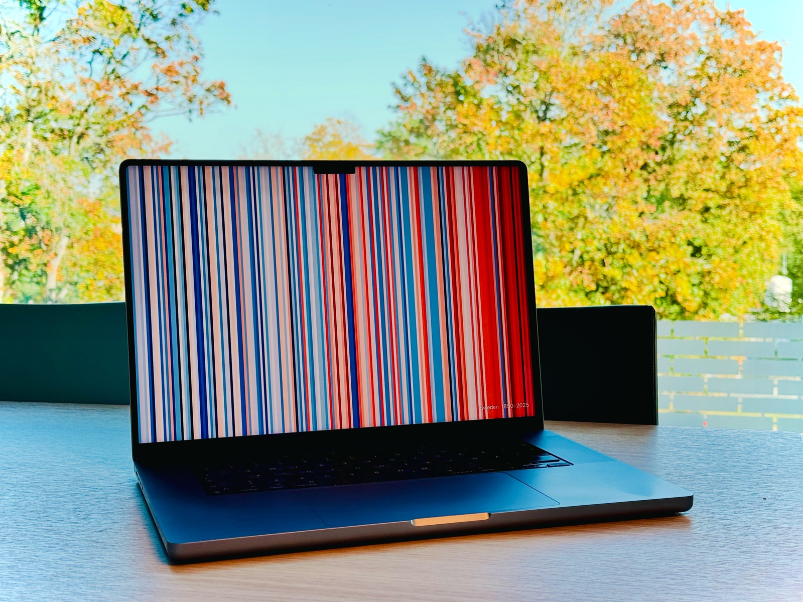
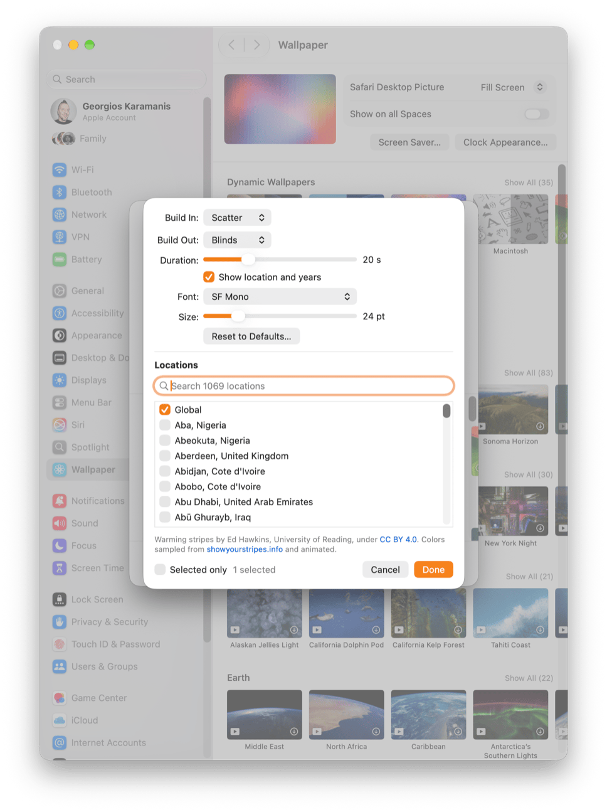

# Warming stripes screensaver for macOS and Windows

**[Download Stripes 1.0](https://github.com/gkaramanis/stripes-saver/releases/download/macos-v1.0/Stripes-1.0.zip)** (288 KB, macOS 13 or later). Install steps are under [Download](#download).

A Windows version by Carey Blunt is in [`windows/`](windows/README.md), with its own install steps.

*Note:* On macOS 26 and later, the `Options…` button can stop responding after the screensaver has run. It's a macOS bug that affects other third-party screensavers too. Quit and reopen System Settings, and `Options…` works again.



Stripes.saver is a macOS screensaver that draws the warming stripes. The default style builds them one year at a time, from left to right, and there are eight other [styles](#styles). It holds the finished picture for 15 seconds, erases it, and starts again with the next location.

The bundle includes all 1,069 locations on [showyourstripes.info](https://showyourstripes.info). It shows Global by default. Under `Options…` you can switch to any other location or tick several, and the saver cycles through them in list order, Global first and the rest alphabetically.

## Download

[Stripes 1.0](https://github.com/gkaramanis/stripes-saver/releases/download/macos-v1.0/Stripes-1.0.zip) (288 KB). Requires macOS 13 or later, Apple silicon or Intel.

I've tested Stripes on macOS 26 and 27 on Apple silicon. It should work on macOS 13 and later and on Intel Macs. If something doesn't work, [open an issue](https://github.com/gkaramanis/stripes-saver/issues) or email me at [stripes@karaman.is](mailto:stripes@karaman.is) with your macOS version and Mac model. Issues with ports to other platforms go to [GitHub issues](https://github.com/gkaramanis/stripes-saver/issues) only, so the person who maintains the port sees them.

1. Unzip and double-click `Stripes.saver`, then choose to install it for this user only.
2. Select Stripes under System Settings → Wallpaper → Screen Saver… → Custom (macOS 26 and later) or System Settings → Screen Saver (macOS 13 to 15).

If `Options…` stops responding, quit and reopen System Settings.

System Settings shows a thumbnail of the stripes. If you installed Stripes before 2 October 2026, it may keep showing a generic image, because macOS caches thumbnails and doesn't refresh them when a screensaver is updated.

## Options

`Options…` sets the build-in style, the build-out style, the duration of each (5 to 60 seconds), whether to show the location and years, the label's font and size (SF Mono at 24 points by default), and which locations to cycle through. `Reset to Defaults…` puts the drawing options back and leaves the locations alone. Each build-out style erases with the motion it builds with. Sweep, for example, blacks out the stripes from left to right. By default the stripes sweep in and fade out. Random deals a new style for each cycle and uses all nine before repeating one.



## Styles

Sweep (the default), Rise, Scatter, Fade, Drop, Flip, Blinds, Iris and Mosaic. The [blog post](https://karaman.is/blog/2026/10/stripes-screensaver#styles) has a clip of each, building the global series in real time at the default 14 seconds.

## Data and credit

The warming stripes were created by [Ed Hawkins](https://edhawkins.org/) (Department of Meteorology, University of Reading). Hawkins took the idea from a crocheted [global warming blanket](https://elliehighwood.com/2017/06/12/climatechangecrochet-the-global-warming-blanket/) that his Reading colleague Ellie Highwood made in 2017, one row per year ([BBC Future](https://www.bbc.com/future/article/20231206-the-coloured-stripes-that-explain-climate-change)).

The warming stripes are published under [CC BY 4.0](https://creativecommons.org/licenses/by/4.0/). Stripes.saver changes the stripes. It samples the colors from the official images at [showyourstripes.info](https://showyourstripes.info) and animates them. The site also lists the temperature datasets behind each location. Each year is one stripe, colored by its temperature relative to the average for the reference period.

The stripes are free to use. Show Your Stripes also accepts [donations](https://showyourstripes.info/support) for climate science and education at the University of Reading.

## Repository layout

| Folder | Contents |
|---|---|
| `data/` | `stripes.json`, shared by every platform, and `sample.py`, which builds it |
| `macos/` | The macOS screensaver |
| `windows/` | The Windows screensaver, by Carey Blunt. See its [README](windows/README.md) |

[SPEC.md](SPEC.md) describes the options, the data and every style in detail, for ports to other platforms. A port goes in its own folder, such as `windows/`, reads `data/stripes.json`, and is released under its own tag, such as `windows-v1.0`. Send changes as pull requests.

## Building

```sh
macos/build.sh install     # build and install into ~/Library/Screen Savers
macos/build.sh release     # sign with Developer ID, notarize, staple, zip to macos/build/
python3 data/sample.py     # refresh data/stripes.json (needs Pillow)
python3 macos/thumbnail.py # redraw the System Settings thumbnails from the data
```

The build is universal (Apple silicon and Intel). `build.sh` uses a full Xcode when one is installed, because the Command Line Tools lack the Intel slice of a Swift support library. `sample.py` caches the images in `data/cache/` (about 35 MB). Delete it to pick up a new year of data.

The Windows build is described in [windows/DESIGN.md](windows/DESIGN.md#building).

## License

The code is MIT licensed. The stripe data is CC BY 4.0, as described under [Data and credit](#data-and-credit).
